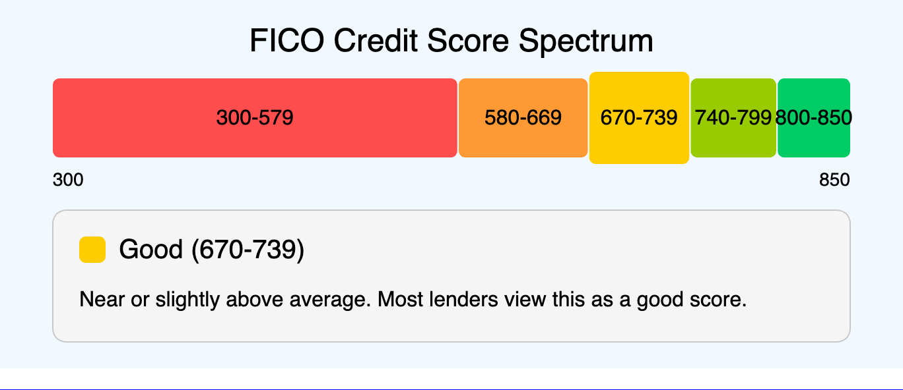

# MicroSims for Finance for Life Course

# MicroSims for Personal Finance

- [Active vx Indexed](./active-vs-indexed/index.md) 
- [College Loan Payback](./college-loan-payback/index.md) 
- [Compound Interest Visualizer](./compound-interest-visualizer/index.md) 
- ) 
- ) 
- ) 
- [Learning Graph](./graph-viewer.html) 
- ) 
- ) 
- ) 
- ) 

