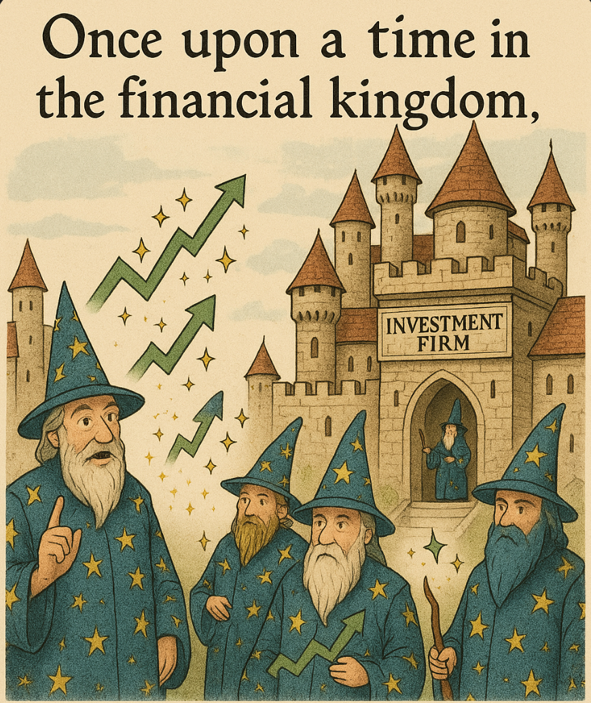
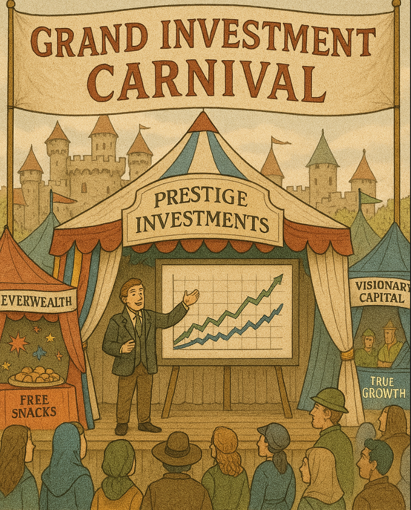
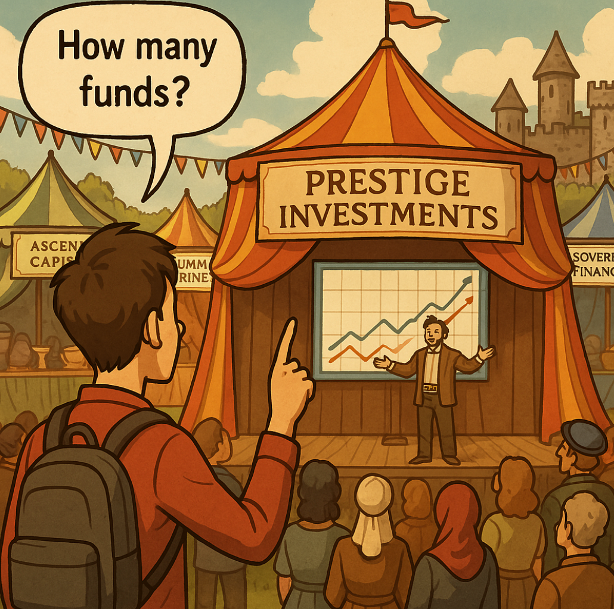
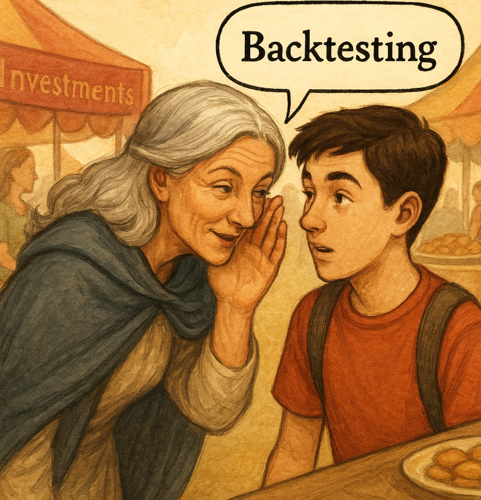
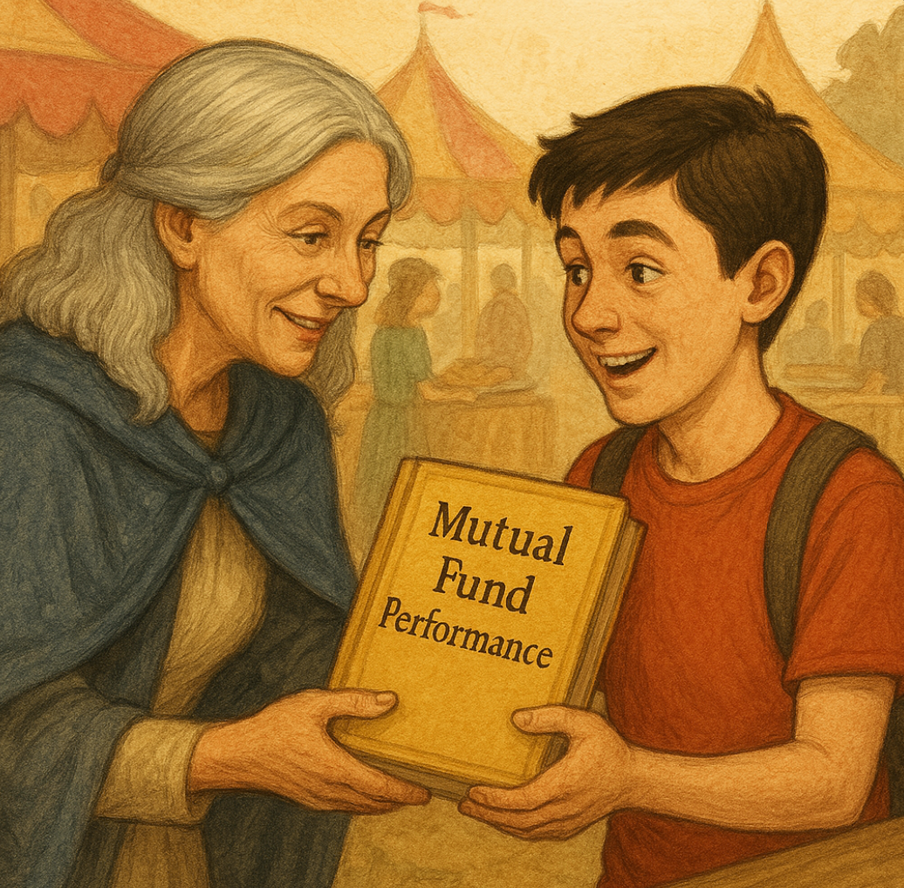

# The Magic Curtain: A Tale of Selection Bias in the Investment World

Once upon a time in the financial kingdom, there lived many magical wizards called "Fund Managers." These wizards claimed to have special powers that could make money grow faster than anyone else. They worked in grand castles called "Investment Firms" and charged hefty fees for their magical services.

## The Grand Investment Carnival

Every year, the kingdom would host a Grand Investment Carnival where all the investment firms would set up elaborate tents to attract new customers. The carnival was always filled with dazzling displays, free snacks, and beautiful charts showing incredible investment returns.

At the most popular tent, Prestige Investments, a charismatic presenter named Morgan stood on stage with a giant screen behind him.

"Ladies and gentlemen!" Morgan announced dramatically. "Behold our amazing family of mutual funds! Our Prestige Tech Growth Fund has returned an astounding 32% last year! Our Prestige Healthcare Opportunities Fund grew by 27%! And our Prestige Emerging Markets Fund delivered a spectacular 35% return!"

The crowd oohed and aahed, impressed by these magical numbers that seemed so much better than the boring 12% that the overall market had returned that year.

## Enter the Skeptical Teen

In the back of the crowd stood Alex, a curious high school student who had recently learned about statistics in math class. While everyone else was dazzled by the presentation, Alex noticed something strange.

"Excuse me," Alex raised a hand. "How many funds does Prestige Investments manage in total?"

Morgan's smile flickered briefly. "Well, we have a comprehensive suite of investment solutions across various sectors and strategies..."

"But how many total funds?" Alex persisted.

Morgan cleared his throat. "Currently, we manage 45 different funds."

"So you're only showing us 3 out of 45 funds?" Alex asked. "What happened to the other 42?"

The crowd grew quiet, suddenly interested in Morgan's answer.

## Behind the Magical Curtain

Morgan tried to change the subject, but Alex had spotted a classic trick: selection bias.

Later that day, Alex met an older woman named Eleanor who had worked in finance for decades before retiring.

*"What you spotted is one of the oldest tricks in the investment world,"* Eleanor explained as they shared an ice cream. *"It's called 'selection bias.' Investment firms launch many funds, then heavily advertise only the ones that perform well, while quietly closing or ignoring the ones that perform poorly."*

*"So it's like if I flipped a coin 100 times, but only told people about the times I got heads?"* asked Alex.

*"Exactly!"* Eleanor nodded. *"They might start with 50 funds, each with different strategies. By random chance alone, a few will outperform the market, even if the managers have no special skill. Then they heavily market those 'winner' funds and either close the losers or just don't mention them."*

## The Survivorship Illusion

Eleanor continued, *"There's a related trick called 'survivorship bias.' If you look at the average performance of all currently existing mutual funds, the numbers look better than they should because the poorly performing funds have been closed or merged away. The failures literally disappear from the record books!"*

*"That's like saying 'all the students at this school get straight A's' after expelling anyone who gets B's or C's,"* Alex remarked.

*"Precisely! And it creates an illusion that picking winning investments is easier than it actually is."*

## The Backtest Fantasy

*"They have another clever trick too,"* Eleanor said, lowering her voice. *"It's called 'backtesting.' They develop an investment strategy, then test it against historical data to see how it would have performed in the past. If it doesn't look good, they tweak the strategy and test again. They keep doing this until they find something that would have worked great in the past."*

*"But that doesn't mean it will work in the future,"* Alex realized.

*"Exactly! It's like creating a strategy to predict yesterday's weather. Of course it works perfectly for the past, but it tells you nothing about tomorrow's forecast."*

## The Bogle Connection

*"This all reminds me of something I read about John Bogle,"* Alex said. *"He founded Vanguard and created index funds partly because he realized how hard it is for active managers to consistently beat the market."*

Eleanor's eyes lit up. *"Jack Bogle was a hero who understood these biases deeply! He showed that once you account for selection bias, survivorship bias, and the high fees of active management, the average actively managed fund actually underperforms the market."*

*"Is that why index funds have become so popular?"* Alex asked.

*"Absolutely. When people realized they were being shown a carefully curated illusion rather than the full picture, many decided they'd rather just own a piece of everything at a low cost."*

## The Truth in Numbers

Before they parted ways, Eleanor gave Alex a golden book containing a reports about mutual fund performance.

*"The data is clear,"* she said. *"Studies show that about 80-90% of active funds underperform their benchmark indexes over a 15-year period. And the few that do outperform are extremely difficult to identify in advance."*

*"So it's not just that the wizards are hiding their failures,"* Alex concluded. *"It's that most of them aren't really wizards at all!"*

*"Now you're getting it,"* Eleanor smiled. *"The greatest magic trick in investing isn't growing money faster than the market—it's convincing people you can do it reliably when the evidence suggests otherwise."*

## The Moral of the Story

As Alex walked home, three important lessons became clear:

1. When someone shows you only their successes, ask about their failures too.
2. Past performance really doesn't guarantee future results—especially when that past performance has been carefully selected.
3. Sometimes the simplest approach—like investing in low-cost index funds that own the entire market—can be the smartest one.

The next time Alex saw a flashy investment advertisement showing spectacular returns, instead of being impressed, the first thought was: "I wonder what they're NOT showing me?"

And that, dear student, is how understanding selection bias can make you a much wiser investor than those who fall for the magic show.

## References

I'll help you find appropriate academic and research-based references to support the key facts in the selection bias story. Let me search for relevant sources.

Let me perform one more search to get more specific data about fund performance:

Now let me search for a reference about backtesting bias:

Let me do one more search to find information about John Bogle and index funds:

Based on my research, here are six scholarly references to support the key facts presented in "The Magic Curtain: A Tale of Selection Bias in the Investment World":

# References

1. Elton, E. J., Gruber, M. J., & Blake, C. R. (1996). Survivorship Bias and Mutual Fund Performance. *The Review of Financial Studies*, 9(4), 1097-1120. This pioneering study documented that mutual funds that merge or die have worse performance than surviving funds, revealing that failure to account for survivorship bias leads to significantly inflated performance metrics in mutual fund studies. They found that "survivorship bias can give a false impression about persistence in mutual fund performance." [https://www.researchgate.net/publication/5217431_Survivorship_Bias_and_Mutual_Fund_Performance](https://www.researchgate.net/publication/5217431_Survivorship_Bias_and_Mutual_Fund_Performance)

2. Brown, S. J., Goetzmann, W., Ibbotson, R. G., & Ross, S. A. (1992). Survivorship Bias in Performance Studies. *The Review of Financial Studies*, 5(4), 553-580. This landmark research analyzed the relationship between volatility and returns in samples truncated by survivorship, demonstrating how this relationship creates the appearance of predictability in fund performance when none truly exists. [https://academic.oup.com/rfs/article-abstract/5/4/553/1590264](https://academic.oup.com/rfs/article-abstract/5/4/553/1590264)

3. S&P Dow Jones Indices (2024). SPIVA® U.S. Scorecard. This industry-standard report consistently shows that over a 15-year period, "there were no categories in which the majority of active managers outperformed" across domestic and international equities. The research indicates that the percentage of underperforming funds typically increases as the time horizon lengthens. [https://www.ifa.com/articles/active-fund-managers-benchmark-analysis-SP](https://www.ifa.com/articles/active-fund-managers-benchmark-analysis-SP)

4. Bailey, D. H., Borwein, J. M., Lopez de Prado, M., & Zhu, Q. J. (2014). Pseudo-Mathematics and Financial Charlatanism: The Effects of Backtest Overfitting on Out-of-Sample Performance. *Notices of the American Mathematical Society*, May, 458-471. This critical paper explains how financial firms develop investment strategies by testing against historical data, repeatedly adjusting until finding something that would have performed well in the past—a practice known as "backtesting" that often leads to poor future performance. [https://datagrid.lbl.gov/backtest/](https://datagrid.lbl.gov/backtest/)

5. Suhonen, A., Lennkh, M., & Perez, F. (2017). Quantifying Backtest Overfitting in Alternative Beta Strategies. *The Journal of Portfolio Management*, 43(2), 90-104. This study used a unique sample of 215 trading strategies developed by global investment banks and found a "median 73% deterioration in Sharpe ratios between backtested and live performance periods for the strategies." This research provides empirical evidence of the significant gap between hypothetical backtest results and actual performance. [https://jpm.pm-research.com/content/43/2/90](https://jpm.pm-research.com/content/43/2/90)

6. Bogle, J. C. (2007). The Little Book of Common Sense Investing: The Only Way to Guarantee Your Fair Share of Stock Market Returns. John Wiley & Sons. John Bogle, founder of Vanguard Group, created the first index fund for individual investors in 1976. His innovative idea was "ridiculed as 'un-American' and 'a sure path to mediocrity'" but has since transformed investing. Warren Buffett stated that "if a statue is ever erected to honor the person who has done the most for American investors, the hands-down choice should be Jack Bogle." [https://venturevoice.substack.com/p/how-john-bogle-started-vanguard-group](https://venturevoice.substack.com/p/how-john-bogle-started-vanguard-group)